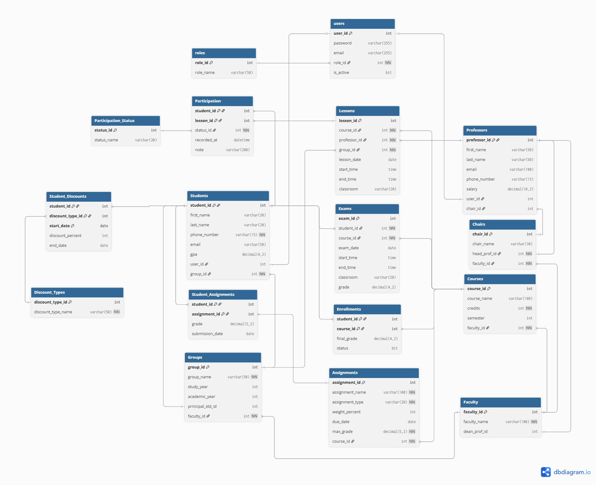

<div align="center">

# 🎓 University Database

[](https://fastapi.tiangolo.com/)
[](https://react.dev/)
[](https://vitejs.dev/)
[](https://www.microsoft.com/en-us/sql-server)
[](https://python.org/)
[](LICENSE)


A full-stack university management system featuring a **FastAPI** REST backend, a **React/Vite** dashboard, and a rich **SQL Server** database with stored procedures, triggers, and views.

[Features](#-features) • [Tech Stack](#-tech-stack) • [Project Structure](#-project-structure) • [Quick Start](#-quick-start) • [Database Setup](#-database-setup) • [Configuration](#-configuration)

</div>

---

## ✨ Features

| Feature | Description |
|---|---|
| 🔐 **JWT Authentication** | Secure login with HS512-signed bearer tokens |
| 👩‍🎓 **Student Portal** | View classmates, courses, assignments, and schedule |
| 👨‍🏫 **Professor Dashboard** | Manage lessons, students, courses, assignments, participation, and exams |
| 📊 **Interactive Tables** | Live CRUD grid powered by stored procedures |
| 🗄️ **Rich SQL Layer** | 25 DQL queries, views, triggers, and stored procedures for data integrity |
| ⚡ **One-Click Launch** | Single `.bat` script installs deps and starts all services |

---

## 🛠 Tech Stack

<table>
  <tr>
    <th>Layer</th>
    <th>Technology</th>
    <th>Purpose</th>
  </tr>
  <tr>
    <td>Frontend</td>
    <td>React 18 + Vite + MUI</td>
    <td>SPA dashboard &amp; sign-in screen</td>
  </tr>
  <tr>
    <td>Backend</td>
    <td>FastAPI + PyODBC + python-jose</td>
    <td>REST API, JWT auth, DB access</td>
  </tr>
  <tr>
    <td>Database</td>
    <td>Microsoft SQL Server 2019+</td>
    <td>Relational data, stored procedures, triggers, views</td>
  </tr>
  <tr>
    <td>Auth</td>
    <td>JWT HS512 (60 min tokens)</td>
    <td>Stateless role-based access control</td>
  </tr>
</table>

---

## 📁 Project Structure

```
University-Database-Project/
├── api/                        # FastAPI backend
│   ├── main.py                 # Routes, authentication, DB access
│   ├── utils.py                # Password hashing & SQL helpers
│   ├── requirements.txt        # Python dependencies
│   └── .env                    # Local environment variables
│
├── frontend/                   # React + Vite SPA
│   ├── src/
│   │   ├── App.jsx             # Main dashboard & table editor
│   │   ├── main.jsx            # App entry point
│   │   ├── sign-in-side/       # Sign-in screen components
│   │   └── shared-theme/       # MUI theme customizations
│   └── package.json
│
├── sql/                        # SQL Server scripts (run in order)
│   ├── 00_create_database.sql
│   ├── 01_create_tables.sql
│   ├── 02–17_*.sql             # Seed data scripts
│   ├── DCL.sql                 # Roles, users, logins & permissions
│   ├── DQL.sql                 # 25 analytical queries
│   ├── procedures.sql          # Stored procedures
│   ├── triggers.sql            # Integrity & business-rule triggers
│   ├── views.sql               # Database views
│   └── master_script.sql       # Runs all scripts in order
│
├── assets/
│   ├── Design.png              # Database design diagram
│   └── Design.pdf
└── Start.bat                   # One-click Windows launcher
```

---

## 🚀 Quick Start

### Prerequisites

- **Python** 3.12 or newer
- **Node.js** 18 or newer
- **SQL Server** (2019+) with **ODBC Driver 18 for SQL Server** installed

### Windows — One-Click Launch

> **Step 1:** Copy the project folder to your Desktop.
>
> **Step 2:** Run the launcher:

```bat
C:\Users\<YourUserName>\Desktop\Database\University Database\Start.bat
```

The script will automatically:

1. Run `npm install` in `frontend/`
2. Install Python dependencies from `api/requirements.txt`
3. Open two terminal windows:
   - **Frontend** → `npm run dev` (http://localhost:5173)
   - **Backend API** → `uvicorn main:app --reload --host 0.0.0.0 --port 8000` (http://localhost:8000)

---

## 🗄️ Database Setup

<details>
<summary><strong>Click to expand setup instructions</strong></summary>

1. Open **SQL Server Management Studio** (or any compatible SQL client).
2. Enable **SQLCMD Mode**: `Query → SQLCMD Mode`
   > ⚠️ Without SQLCMD Mode, the `:r` include directives in `master_script.sql` will fail.
3. Open and run `sql/master_script.sql`.
   This single script creates the database, all tables, inserts seed data, and applies DCL permissions in the correct order.
4. Verify the connection settings in `api/.env` match your SQL Server instance.

</details>

### SQL Scripts Reference

<details>
<summary><strong>View all SQL scripts</strong></summary>

| Script | Description |
|---|---|
| `00_create_database.sql` | Creates the `uni` database |
| `01_create_tables.sql` | Creates all schema objects |
| `02_participation_status.sql` | Participation status lookup values |
| `03_professors.sql` | Professor records |
| `04_faculty_and_chairs.sql` | Faculty and chair records |
| `05_assign_chairs.sql` | Assigns professors to chairs |
| `06_discount_types.sql` | Discount type lookup values |
| `07_courses.sql` | Course records |
| `08_groups.sql` | Student group records |
| `09_students.sql` | Student records |
| `10_assign_groups_principals.sql` | Assigns group principals |
| `11_lessons.sql` | Lesson schedule records |
| `12_exams.sql` | Exam records |
| `13_enrollments.sql` | Enrollment records |
| `14_assignments.sql` | Assignment records |
| `15_participation.sql` | Participation records |
| `16_student_discounts.sql` | Student discount records |
| `17_student_assignmnets.sql` | Student assignment records |
| `DCL.sql` | Roles, users, logins & permissions |
| `DQL.sql` | 25 analytical / verification queries |
| `procedures.sql` | Application stored procedures |
| `triggers.sql` | Integrity & business-rule triggers |
| `views.sql` | Database views for backend & reporting |
| `master_script.sql` | Orchestrates all scripts in order |

</details>

---

## ⚙️ Configuration

Create `api/.env` before starting the backend:

```env
# JWT
JWT_SECRET_KEY=your-secret-key

# SQL Server
DB_SERVER=localhost\SQLSERVER
DB_NAME=uni
DB_USER=your-username
DB_PASSWORD=your-password
DB_DRIVER=ODBC Driver 18 for SQL Server
DB_ENCRYPT=yes
DB_TRUST_SERVER_CERTIFICATE=yes

# CORS
CORS_ORIGINS=http://localhost:5173
```

> If you change the backend host, frontend host, or SQL Server credentials, update `api/.env` accordingly.

---

## 🗺️ Database Design

<div align="center">
  
</div>

---

## 📌 Notes

- The backend enforces **role-based access control**: students see read-only views; professors interact with editable stored-procedure tables.
- Access tokens are stored in browser **local storage** and attached as `Authorization: Bearer <token>` headers.
- Token lifetime is **60 minutes**; re-login is required after expiry.
